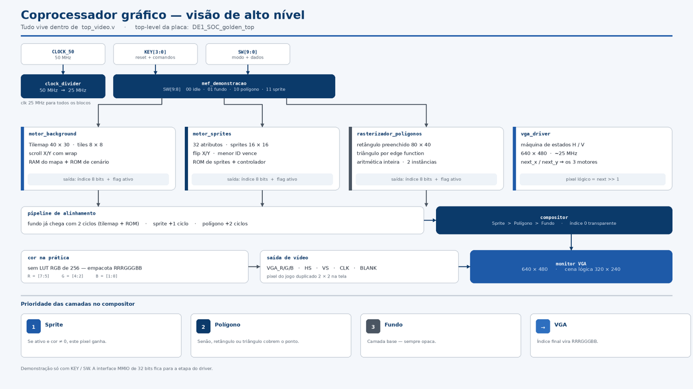

# PBL-SD
Coprocessador gráfico em FPGA - TEC499

# Coprocessador Gráfico VGA Multicamadas em FPGA

Este repositório contém a documentação e o código-fonte de um coprocessador gráfico desenvolvido em hardware para a placa FPGA DE1-SoC (Intel Cyclone V).

---

## 1. Manual do Sistema

Este manual destina-se a engenheiros de computação e desenvolvedores, fornecendo a documentação técnica necessária para compreender e utilizar o sistema.

### 1.1 Declaração do Problema e Requisitos

O problema central deste projeto consistiu no desenvolvimento de um coprocessador gráfico em hardware capaz de gerenciar e renderizar múltiplas camadas gráficas de forma simultânea. O objetivo do hardware é atuar como um acelerador dedicado, libertando o processador principal (CPU) do cálculo exaustivo de varredura de pixels. 

Para que a solução resolva o problema, o sistema foi projetado para atender aos seguintes requisitos, abrangendo as especificações explícitas do problema e as necessidades implícitas da arquitetura digital:

*   **Geração de Sinal de Vídeo (Explícito):** Sintetizar um sinal analógico VGA com resolução física de 640x480 pixels a uma taxa de atualização de 60 Hz, fornecendo os pulsos de sincronismo vertical e horizontal ao monitor.
*   **Múltiplas Camadas de Renderização (Explícito):** Instanciar e orquestrar três motores gráficos independentes: um cenário de fundo (*Background*), um gerador de formas geométricas (Rasterizador de Polígonos) e um controlador de entidades móveis (*Sprites*).
*   **Controle e Datapath Multiplexado (Explícito):** Integrar os periféricos da placa (chaves `SW` e botões `KEY`) através de uma Máquina de Estados Finitos (MEF), roteando os comandos do usuário para o motor gráfico correspondente sem sobreposição indesejada de ações.
*   **Sincronização e Resolução de Conflitos Visuais (Implícito):** Implementar um Compositor capaz de arbitrar qual camada gráfica deve ser exibida quando há sobreposição espacial (Prioridade: Sprite > Polígono > Background). Adicionalmente, compensar a latência de leitura das memórias *Dual-Port* através de um *pipeline* de atraso temporal para alinhar a saída dos pixels.
*   **Gerenciamento Eficiente de Memória (Implícito):** Otimizar o uso de blocos BRAM internos da FPGA. Para o cenário, adotar a arquitetura de *Tilemaps* vinculada a uma ROM compartilhada de texturas em vez de *framebuffers* completos. Para os sprites, implementar uma RAM de atributos dinâmica.

### 1.2 Arquitetura da Solução Proposta



A solução resolve o problema da renderização simultânea adotando uma arquitetura paralela de processamento de vídeo, orquestrada dentro do módulo principal `top_video.v` (instanciado no topo da placa `DE1_SOC_golden_top`). O sistema é dividido conceitualmente em três grandes eixos: Controle (Datapath), Geração de Coordenadas e Motores de Renderização.

**Fluxo de Controle e Dados:**
1. **Entradas e Roteamento (MEF):** Os controles físicos do usuário (`KEY[3:0]` e `SW[9:0]`) alimentam a Máquina de Estados Finitos (`mef_demonstracao`). A MEF atua como um multiplexador inteligente: ela lê os bits seletores de estado (`SW[9:8]`) e direciona os sinais dos botões (que funcionam como "direcionais" e "confirmar") e das chaves de dados apenas para o motor gráfico correspondente (Background, Polígonos ou Sprites). Isso resolve o problema de sobreposição de comandos, permitindo que a mesma interface física controle múltiplas camadas de forma independente.
2. **Base de Tempo e Coordenadas:** O módulo `clock_divider` reduz o relógio da placa de 50 MHz para 25 MHz, alimentando o `vga_driver`. O driver varre a tela e fornece as coordenadas físicas atuais (`next_x` e `next_y`) de 640x480 pixels. Para otimizar o processamento e a memória, essas coordenadas sofrem um deslocamento de bits lógico (`>> 1`), transformando a área de processamento interno dos motores gráficos em uma resolução lógica de 320x240 pixels (onde cada pixel computado é duplicado visualmente num bloco 2x2 na tela).
3. **Renderização Paralela:** As coordenadas lógicas alimentam simultaneamente os três motores de vídeo (`motor_background`, `motor_sprites` e `rasterizador_poligonos`). Cada bloco calcula de forma isolada qual deve ser a cor daquele pixel exato na sua respectiva camada.
4. **Sincronização (Pipeline):** Como o motor de cenário exige consultas encadeadas em memória (ler o Tilemap na RAM e depois a textura na ROM), ele possui um atraso inerente de 2 ciclos de *clock*. Para evitar que os sprites e polígonos fiquem "desalinhados" na tela em relação ao fundo, seus sinais passam por registradores de atraso (*Pipeline de Alinhamento*).
5. **Composição e Saída:** Os três sinais, agora perfeitamente sincronizados, entram no `compositor`. Ele aplica a regra matemática de sobreposição (Sprite > Polígono > Fundo), tratando o índice de cor `0` como transparente. O pixel vencedor é convertido diretamente para um empacotamento RGB de 8 bits (RRRGGGBB) e enviado aos pinos VGA analógicos da placa.


### 1.3 Detalhamento dos Blocos Funcionais e Código-Fonte

Esta seção descreve a mecânica interna de cada módulo, detalhando o fluxo de dados (entradas e saídas) e o processamento lógico.

#### 1.3.1 Gerador de Temporização de Vídeo (`vga_driver.v`)

O `vga_driver` atua como o coração temporal do sistema. Seu papel é garantir que o monitor receba os dados no momento exato em que o feixe de varredura está desenhando a tela.

*   **Entradas:** Recebe o `clock` reduzido de 25 MHz (padrão para 640x480 a 60 Hz), o sinal de `reset`, e a cor final processada `color_in` no formato de 8 bits (RRRGGGBB).
*   **Processamento:** Utiliza uma máquina de estados e contadores horizontais (`h_counter`) e verticais (`v_counter`) para simular o comportamento de um monitor CRT. Ele percorre as zonas ativas (onde há imagem) e as zonas mortas (*Front Porch*, *Sync Pulse* e *Back Porch*) para gerar os pulsos de sincronismo `hsync` e `vsync`.
*   **Saídas:** Exporta os sinais analógicos `red`, `green`, `blue` e os sincronismos para os pinos da placa. Fundamentalmente, exporta as coordenadas `next_x` e `next_y`, avisando aos demais blocos qual pixel será renderizado no próximo ciclo de *clock*.

**Trecho de Código Principal (Geração de Coordenadas):**
```verilog
// ... (Declaração de estados e parâmetros do VGA) ...

// A máquina de estados incrementa o h_counter. Ao fim da linha, zera o h_counter e incrementa o v_counter.
// As coordenadas físicas (next_x, next_y) só recebem os valores dos contadores durante a área ativa da tela.
// Nas áreas de "blanking" (sincronismo), as coordenadas são forçadas para 0.
assign next_x = (h_state == H_ACTIVE_STATE) ? h_counter : 10'd_0 ;
assign next_y = (v_state == V_ACTIVE_STATE) ? v_counter : 10'd_0 ;

// A cor de entrada é mapeada diretamente para os canais RGB ignorando paletas complexas (conversão direta RRRGGGBB)
always@(posedge clock) begin
    // ...
    red_reg   <= (h_state==H_ACTIVE_STATE) ? ((v_state==V_ACTIVE_STATE) ? {color_in[7:5],5'd_0} : 8'd_0) : 8'd_0 ;
    green_reg <= (h_state==H_ACTIVE_STATE) ? ((v_state==V_ACTIVE_STATE) ? {color_in[4:2],5'd_0} : 8'd_0) : 8'd_0 ;
    blue_reg  <= (h_state==H_ACTIVE_STATE) ? ((v_state==V_ACTIVE_STATE) ? {color_in[1:0],6'd_0} : 8'd_0) : 8'd_0 ;
end
```

#### 1.3.2 Motor de Cenário e Memórias (`motor_background.v`)

Este módulo renderiza uma malha contínua de cenários formada por blocos de texturas (*tiles*) de 8x8 pixels.

*   **Entradas:** Recebe as coordenadas `next_x` e `next_y` e os deslocamentos de câmera `scroll_x` e `scroll_y`. Além disso, possui uma interface de escrita (`tm_wr_en`, `tm_wr_addr`, `tm_wr_data`) para modificar a fase do jogo em tempo real.
*   **Processamento:** O motor converte a resolução física 640x480 para lógica (deslocando 1 bit das coordenadas para a direita) e soma o valor de *scroll*. O sistema recicla as coordenadas (*wrap-around*) usando lógica de módulo (ex: `scrolled_x_full >= 320`) para dar a ilusão de um mundo infinito. O endereço do tile (linha e coluna) é enviado à RAM Dual-Port (`ram_tilemap.v`), que devolve o ID do bloco. Esse ID, somado à posição do pixel interno do bloco, consulta a ROM (`rom_cenario_tile.v`).
*   **Saídas:** A cor específica do pixel daquele tile (`cor_pixel`) e o endereço de memória para consulta da textura compartilhada (`rom_addr`).

**Trecho de Código Principal (Matemática Espacial e Paginação):**
```verilog
// 1. Resolução Lógica: Descarta o bit menos significativo para transformar 640x480 em 320x240
wire [8:0] logical_x = next_x[9:1];
wire [7:0] logical_y = next_y[9:1];

// 2. Scroll: Soma a posição estática da tela com o deslocamento da câmera
wire [9:0] scrolled_x_full = logical_x + scroll_x;
wire [8:0] scrolled_y_full = logical_y + scroll_y;

// 3. Wrap-around (Bordas Infinitas): Se passar de 320 ou 240, reinicia do zero subtraindo o limite
wire [8:0] scrolled_x = (scrolled_x_full >= 10'd320) ? (scrolled_x_full - 10'd320) : scrolled_x_full[8:0];
wire [7:0] scrolled_y = (scrolled_y_full >= 9'd240) ? (scrolled_y_full - 9'd240) : scrolled_y_full[7:0];

// 4. Divisão do Tile: Como cada tile tem 8x8 pixels (2^3), os 3 bits menos significativos 
//    são o "pixel" dentro do tile, e o restante forma a coluna/linha do mapa.
wire [5:0] tile_col = scrolled_x[8:3];
wire [4:0] tile_row = scrolled_y[7:3];
wire [2:0] pixel_x  = scrolled_x[2:0];
wire [2:0] pixel_y  = scrolled_y[2:0];

// O endereço do mapa (matriz 1D) é calculado por: (linha * largura) + coluna
wire [10:0] tilemap_addr = (tile_row * 11'd40) + tile_col;
```
#### 1.3.3 Rasterizador de Polígonos (`rasterizador_poligonos.v`)

Este módulo é o hardware responsável por desenhar formas geométricas preenchidas (retângulos e triângulos) diretamente na tela, testando se o pixel atual pertence à área da forma.

*   **Entradas:** Coordenadas lógicas da tela (`jogo_x`, `jogo_y`), seletor de forma (`modo_ativo`), as coordenadas dos vértices (`x0`, `y0` até `x2`, `y2`) e a cor desejada (`cor_indice`).
*   **Processamento:** Para o retângulo, o hardware utiliza comparadores lógicos simples (verificando se X e Y estão entre as bordas). Para o triângulo, utiliza-se a Função de Aresta (*Edge Function*). Para corrigir erros de *underflow* (estouro de bit) durante a subtração geométrica, as coordenadas de entrada de 9/8 bits sem sinal são convertidas para 11 bits com sinal (`signed`) preenchendo com zeros à esquerda. Isso garante diferenças seguras de 12 bits e cálculos de área precisos de 24 bits.
*   **Saídas:** Um sinal de ativação (`poly_ativo`) e a cor correspondente (`poly_color`), indicando ao compositor que aquele pixel pertence ao polígono.

**Trecho de Código Principal (Correção Numérica do Triângulo):**
```verilog
    // 1. Extensão para 11 bits COM SINAL (evita underflow nas subtrações de coordenadas negativas)
    wire signed [10:0] x0s = {2'b00, x0};
    wire signed [10:0] x1s = {2'b00, x1};
    wire signed [10:0] y0s = {2'b00, y0};
    wire signed [10:0] y1s = {2'b00, y1};
    wire signed [10:0] jxs = {2'b00, jogo_x};
    wire signed [10:0] jys = {3'b000, jogo_y};

    // 2. Diferenças dimensionadas para 12 bits com sinal
    wire signed [11:0] dx01 = x1s - x0s;
    wire signed [11:0] dy01 = y1s - y0s;
    wire signed [11:0] pjx0 = jxs - x0s;
    wire signed [11:0] pjy0 = jys - y0s;

    // 3. Função de Aresta (Produto vetorial) dimensionado para 24 bits com sinal
    wire signed [23:0] e01 = (dx01 * pjy0) - (dy01 * pjx0);
    
    // O pixel está dentro se apresentar o mesmo sinal para as 3 arestas
    wire dentro_triangulo = (e01 >= 0 && e12 >= 0 && e20 >= 0) ||
                            (e01 <= 0 && e12 <= 0 && e20 <= 0);
```
#### 1.3.4 Motor e Controlador de Sprites (`motor_sprites.v` e `controlador_sprite.v`)

O subsistema de sprites gerencia entidades dinâmicas de 16x16 pixels que podem se mover livremente sobre o cenário.

*   **Entradas:** Coordenadas lógicas do pixel e os comandos roteados pela Máquina de Estados (direcionais, chave de alvo `id_alvo`, chave de virar `modo_flip` e chave de troca de textura `sw_change_char`).
*   **Processamento:** 
    *   O `controlador_sprite` gerencia arrays de estado independentes (posição X/Y, índice da textura e flip H/V) para múltiplos alvos, empacotando essas propriedades em palavras de 32 bits e gravando na memória de atributos do motor.
    *   O `motor_sprites` armazena 32 atributos. A cada pixel varrido, ele testa colisões contra todos os 32 sprites simultaneamente. O laço de repetição verifica a prioridade de forma reversa (de 31 até 0), garantindo que o Sprite 0 (o "Player") sempre sobreponha os demais em caso de sobreposição.
*   **Saídas:** O sinal visual final da entidade (`sprite_color`) e seu estado de ativação (`sprite_ativo`) devidamente alinhados com a leitura da ROM dedicada de sprites.

**Trecho de Código Principal (Decodificador de Prioridade):**
```verilog
    // Máscara de acerto: testa se o pixel lógico atual está dentro da área 16x16 de algum sprite
    assign hit_mask[i] = spr_enable && (diff_x < 9'd16) && (diff_y < 8'd16);

    reg [4:0] winner_idx;
    reg       winner_hit;
    integer j;
    
    // Resolução de Prioridade: varre do maior para o menor ID.
    // Como os IDs menores são testados por último, eles sobrescrevem o winner_idx,
    // garantindo que o Sprite 0 sempre vença se houver intersecção espacial.
    always @(*) begin
        winner_hit = 1'b0;
        winner_idx = 5'd0;
        for (j = 31; j >= 0; j = j - 1) begin
            if (hit_mask[j]) begin
                winner_hit = 1'b1;
                winner_idx = j[4:0];
            end
        end
    end
```

#### 1.3.5 Máquina de Estados e Compositor (`mef_demonstracao.v` e `compositor.v`)

O controle e a unificação das imagens ocorrem na última etapa do processamento lógico. A MEF gerencia os botões do usuário, enquanto o Compositor unifica as camadas visuais.

*   **Entradas (MEF):** Chaves da placa (`SW[9:8]` como seletores de modo, `SW[7:0]` como dados) e os botões (`KEY[3:0]`).
*   **Processamento (MEF):** Atua como um roteador de contexto (*Datapath*). Se `SW[9:8]` for `01`, os comandos dos botões são enviados ao Background. Se for `10`, aos Polígonos. Se for `11`, aos Sprites. Isso garante que o usuário não mova o cenário e o personagem ao mesmo tempo com o mesmo botão.
*   **Processamento (Compositor):** Recebe a cor e o sinal de ativação dos três motores. Como a RAM do cenário leva 2 ciclos de *clock* para devolver a cor, o compositor atrasa os sinais dos Sprites e Polígonos (usando flip-flops em cascata, formando um *Pipeline*) para que todas as camadas cheguem no mesmo instante. A resolução de prioridade obedece à regra: se o Sprite está ativo e sua cor não é `0` (transparente), ele vence. Caso contrário, testa-se o Polígono e, por fim, o Fundo.
*   **Saídas:** A cor final de 8 bits do pixel que efetivamente será enviada ao monitor VGA.

**Trecho de Código Principal (Regra de Prioridade no Compositor):**
```verilog
    // O Índice 0 na paleta das ROMs é tratado como "Transparente".
    // A lógica testa em cascata respeitando a sobreposição: Sprite > Polígono > Background
    always @(*) begin
        cor_final = 8'd0; 
        
        if (sprite_ativo_pipe && sprite_color_pipe != 8'd0) begin
            cor_final = sprite_color_pipe;
        end 
        else if (poly_ativo_pipe && poly_color_pipe != 8'd0) begin
            cor_final = poly_color_pipe;
        end 
        else if (bg_ativo_pipe && bg_color_pipe != 8'd0) begin
            cor_final = bg_color_pipe;
        end
    end
```

### 1.4 Testes

Para garantir que a arquitetura atenda a todos os requisitos do problema, estruturou-se um plano de validação em hardware. Os testes foram planejados para isolar cada módulo inicialmente, validando sua matemática e temporização, e culminar no teste de integração multicamadas.

*   **Teste 1 - Validação da Base de Tempo e Cenário:**
    *   **Objetivo:** Comprovar a geração correta do sincronismo VGA a 60 Hz e a leitura estável das memórias *Dual-Port* e ROM.
    *   **Ação:** Ativar o modo Fundo (`SW[9:8] = 01`) e utilizar os botões direcionais.
    *   **Resultado Esperado:** A imagem do *Tilemap* deve ser exibida sem distorções horizontais ou verticais. O deslocamento da câmera (*scroll*) deve empurrar a tela revelando novos tiles, aplicando o *wrap-around* (retorno da borda) sem falhas de paginação.

*   **Teste 2 - Validação Matemática dos Polígonos:**
    *   **Objetivo:** Confirmar a eficácia da *Edge Function* com expansão de bits sinalizados, garantindo que não ocorra *underflow*.
    *   **Ação:** Ativar o modo Polígono (`SW[9:8] = 10`) e testar a geração do Retângulo e, em seguida, do Triângulo.
    *   **Resultado Esperado:** As formas devem ser preenchidas de forma sólida. O Triângulo não deve apresentar pixels vazados, cintilações ou áreas corrompidas, comprovando que as diferenças dimensionadas para 12/24 bits com sinal seguraram as coordenadas negativas.

*   **Teste 3 - Estresse e Prioridade de Sprites:**
    *   **Objetivo:** Validar o controle individual das 32 entidades em tela, espelhamento dinâmico e o roteamento de borda na troca de personagem.
    *   **Ação:** Ativar o modo Sprite (`SW[9:8] = 11`), selecionar diferentes índices (`SW[5:4]`), acionar o espelhamento (`SW[7]`) e o detector de borda para ciclo de personagem (`SW[6]`). Colidir o Sprite 0 contra o Sprite 1.
    *   **Resultado Esperado:** Cada personagem deve responder independentemente. A chave `SW[6]` deve avançar o personagem uma única vez por acionamento. Na colisão, o Sprite 0 deve obrigatoriamente se sobrepor ao Sprite 1, provando a eficácia do decodificador de prioridade reversa.

*   **Teste 4 - Integração e Pipeline de Atraso:**
    *   **Objetivo:** Validar o Compositor e o alinhamento temporal das camadas.
    *   **Ação:** Posicionar um Sprite sobre um Triângulo, e ambos sobre o Cenário.
    *   **Resultado Esperado:** A cor preta (índice 0) dos limites do Sprite deve ser transparente, revelando o Triângulo embaixo. Não devem ocorrer "fantasmas" ou bordas desalinhadas, provando que o *pipeline* de 2 ciclos atrasou corretamente os dados imediatos para casar com a leitura atrasada da memória do cenário.

 ## 2. Manual do Usuário

Este manual orienta a operação do coprocessador gráfico na placa DE1-SoC e apresenta a discussão dos resultados obtidos durante a validação em hardware, integrando as instruções de uso aos testes do sistema.

### 2.1 Configuração Inicial
1. Conecte um cabo e um monitor padrão VGA à porta de vídeo da placa DE1-SoC.
2. Conecte a placa ao computador via cabo USB e ligue a alimentação de energia.
3. Utilize o software Quartus Prime para carregar o projeto.
4. O monitor exibirá instantaneamente a composição das três camadas (Cenário, Polígonos e Sprites) na resolução física de 640x480 pixels.

### 2.2 Mapa de Controles Gerais
O roteamento dos comandos é feito pelas chaves `SW[9:8]`. Altere essas chaves para escolher qual camada da tela os botões `KEY[3:0]` irão controlar.

| Chaves `SW[9:8]` | Modo Ativo | Função dos Botões `KEY[3:0]` |
| :--- | :--- | :--- |
| `00` | **Ocioso / Visualização** | Nenhuma ação de deslocamento. A tela permanece estática. |
| `01` | **Controle do Background** | Movem a câmera (Scroll) pelo mapa do cenário em 4 direções. |
| `10` | **Controle de Polígonos** | Movem a posição espacial do polígono ativo pela tela. |
| `11` | **Controle de Sprites** | Controlam o movimento e espelhamento do Sprite selecionado. |

## 3. Conclusão

O desenvolvimento deste coprocessador gráfico em FPGA demonstrou com sucesso a viabilidade de uma arquitetura de renderização de vídeo totalmente em hardware. A integração dos três motores gráficos independentes — aliada ao roteamento da Máquina de Estados (MEF) e ao *pipeline* de sincronização do Compositor — permitiu a geração de um sinal VGA estável com múltiplas camadas sobrepostas. Por fim, os resultados dos testes práticos atestam que todos os requisitos operacionais, visuais e de controle foram plenamente atingidos, entregando um sistema robusto, responsivo e pronto para futuras expansões.
